```mermaid
graph RL

    subgraph autre
    A[👁️‍🗨️✚🔄🗑️]
    B[🎯🌱🚀⚰️]
        style autre fill:#777, color:#FFF
        subgraph package[Developed package]
            style package fill:#88A, color:#FFF
            example1[example]
        end

        subgraph not-package[Not developed package]
            style not-package fill:#555, color:#FFF
            example2[example]
        end

        subgraph dev[🚧 under construction 🚧]
            style dev fill:#363, color:#FFF
            example3[/🚧 example 🚧\]
        end
    end


    classDef python fill:#FFDC52, color:#000;
    classDef fastapi fill:#059286, color:#45D2C6
    classDef openai fill:#FFF, color:#000;
    classDef mysql fill:#00618B, color:#40A1CB
    classDef sqlite fill:#4FC0FC, color:#0F80CC
    classDef file fill:#BBB, color:#333
    classDef tfile fill:#888, color:#333
```

# AI SUBJECT MONITORING PROJECT
AI Subject Monitoring Project with mermaid

  
<strong>📌 Table of Contents</strong>

  * [Legend](#legend)
  * [Global workflow - Flowchart](#flowchart)

| Developement            | Link 1                                  | Link 2                                                  | Link 3                                    |
|-------------------------|-----------------------------------------|---------------------------------------------------------|-------------------------------------------|
| **Linux machine**       | [Linux machine](#linux-machine)         | [Linux crontab](#linux-crontab)                         | [Shell scripts](#shell-scripts)           |
| **Podcast Watchdog**    | [Flowchart](#PW-flowchart)              |                                                         |                                           |
| **News sites**          | [Flowchart](#NS-flowchart)              |                                                         |                                           |
| **Manage newsletters**  | [Flowchart](#MN-flowchart)              |                                                         |                                           |
| **ChrisAI-research**    | [Flowchart](#CAIR-flowchart)            |                                                         |                                           |
| **Monitoring AI tools** | [Flowchart](#MAIT-flowchart)            |                                                         |                                           |
| **Newsletter**          | [Flowchart](#N-flowchart)               |                                                         |                                           |
| **Global DB**           | [Flowchart](#GDB-flowchart)             |                                                         |                                           |
| **APIs**                | [Transcribe Flowchart](#Tapi-flowchart) | [I/O API: transcription-API](#io-api-transcription-api) | [I/O API: OpenAI API](#io-api-openai-api) |

# Global workflow

## Legend

```mermaid
graph LR
    subgraph Legend [Legend]
        style Legend fill:#777, color:#000

        subgraph machine
            style machine fill:#777, color:#FFF
            subgraph package[Developed package]
                style package fill:#88A, color:#FFF
                example1[example]
            end
    
            subgraph not-package[Not developed package]
                style not-package fill:#555, color:#FFF
                example2[example]
            end

            subgraph dev[🚧 under construction 🚧]
                style dev fill:#363, color:#FFF
                example3[/🚧 example 🚧\]
            end
        end

        subgraph code
            style code fill:#777, color:#000
            
            L1[python scripts]:::python
            L2[Linux shell]:::shell
            L3[/FastAPI/]:::fastapi
            L4[/OpenAI/]:::openai
            L5[Other]
        end

        subgraph DBMS
            style DBMS fill:#777, color:#000

            L6[(MySQL)]:::mysql
            L7[(SQLite)]:::sqlite
        end

        subgraph files
            style files fill:#777, color:#000

            Lf1@{ shape: doc, label: "📄 File" }
            Lf1:::file
            Lf2@{ shape: docs, label: "📄 files" }
            Lf2:::file
            Lf3@{ shape: docs, label: "📄 temporary files" }
            Lf3:::tfile
        end

        subgraph actions[Actions emoji]
            style actions fill:#777, color:#000

            Lf4@{ shape: doc, label: "📄 File" }
            Lf5@{ shape: doc, label: "📄 File" }
            Lf6@{ shape: doc, label: "📄 File" }
            Lf7@{ shape: doc, label: "📄 File" }

            a1(read file) -->|👁️‍🗨️| Lf4:::file
            a3(create file) -->|✚| Lf5:::file
            a5(update file) -->|🔄| Lf6:::file
            a7(delete file) -->|🗑️| Lf7:::file
        end

        subgraph sql[SQL emoji : SIUD]
            style sql fill:#777, color:#000

            s1(SQL SELECT) -.->|🎯| s2[(Database)]:::mysql
            s3(SQL INSERT) -.->|🌱| s4[(Database)]:::sqlite
            s5(SQL UPDATE) -.->|🚀| s6[(Database)]:::mysql
            s7(SQL DELETE) -.->|⚰️| s8[(Database)]:::sqlite
        end
    end
    

    classDef python fill:#FFDC52, color:#000;
    classDef fastapi fill:#059286, color:#45D2C6
    classDef openai fill:#FFF, color:#000;
    classDef mysql fill:#00618B, color:#40A1CB
    classDef sqlite fill:#4FC0FC, color:#0F80CC
    classDef shell fill:#000, color:#49F75C
    classDef file fill:#BBB, color:#333
    classDef tfile fill:#888, color:#333
```

## Flowchart

```mermaid
graph LR
    subgraph APIs1[external APIs]
        style APIs1 fill:#777, color:#FFF
        
        subgraph OpenAI
            style OpenAI fill:#555, color:#FFF
            subg-APIs-B[/API/]:::openai
        end
    end

    subgraph machine[Linux machine]
        style machine fill:#777, color:#FFF

        subgraph crontab[Linux Crontab]
            style crontab fill:#363, color:#FFF
            A(⏱️ Crontab: weekly)
        end

        subgraph scripts[Shell scripts]
            style scripts fill:#363, color:#FFF
            
            A --> B[Podcast Watchdog]:::shell
            A --> C[Scrape-latest-posts-from-news-sites]:::shell
            A --> D[manage-newsletters]:::shell
            A --> E[ChrisAI-research]:::shell
            A ==> F[newsletter]:::shell
        end


        subgraph subg-b[Podcast Watchdog]
            style subg-b fill:#88A, color:#FFF

            B -->|main.py| subg-b-A[python POO]:::python
            subg-b-A -.->|🎯🌱🚀| dbpodcast[(podcast.db)]:::sqlite
            subg-b-A -->|✚| transcribe@{ shape: docs, label: "📄 XX_podcast.txt" }
            transcribe:::file

            subg-b-A <-->|role + prompt > txt| subg-APIs-B
        end

        subgraph subg-c[Scraping news sites]
            style subg-c fill:#363, color:#FFF
            C -->|main.py| subg-c-A[/🚧 under construction 🚧\]:::python
        end

        subgraph subg-d[Manage newsletters]
            style subg-d fill:#88A, color:#FFF

            D -->|main.py| subg-d-A[python POO]:::python
        end

        subgraph subg-e[ChrisAI-research]
            style subg-e fill:#363, color:#FFF
            E -->|main.py| subg-e-A[/🚧 under construction 🚧\]:::python
        end

        subgraph transcription-API
            style transcription-API fill:#88A, color:#FFF
            subg-b-A <-->|EndPoint:transcribe| subg-APIs-A[/main.py: transcribe/]:::fastapi
        end

        subgraph subg-g[Monitoring AI tools]
            style subg-g fill:#88A, color:#FFF

            G(🫳⌨️ manual launch) --> subg-g-A[python POO]:::python
            subg-g-A -.->|🌱| subg-g-B[(ai_tools.db)]:::sqlite
        end

        subgraph subg-mysql[Global DB]
            style subg-mysql fill:#363, color:#FFF
            info1[/🚧 under construction 🚧\]
            subg-b-A -.->|🌱| subg-mysql-A[(ai-subject-monitoring)]:::mysql
            subg-c-A -.->|🌱| subg-mysql-A
            subg-e-A -.->|🌱| subg-mysql-A
            subg-d-A -.->|🌱| subg-mysql-A
            subg-g-A -.->|🌱| subg-mysql-A
        end

        subgraph subg-f[Newsletter]
            style subg-f fill:#363, color:#FFF
            
            F ==>|main.py| subg-f-A[/🚧 under construction 🚧\]:::python
            subg-f-A -.->|🎯🚀| subg-mysql-A
        end
    end

    subgraph APIs2[external APIs]
        style APIs2 fill:#777, color:#FFF

        subgraph Outlook
            style Outlook fill:#555, color:#FFF

            subg-d-A --> |📬🔀📨🧨| subg-APIs-C[/📧 API/]
            subg-f-A ==>|📨| subg-APIs-C
        end
    end


    classDef python fill:#FFDC52, color:#000;
    classDef fastapi fill:#059286, color:#45D2C6
    classDef openai fill:#FFF, color:#000;
    classDef mysql fill:#00618B, color:#40A1CB
    classDef sqlite fill:#4FC0FC, color:#0F80CC
    classDef shell fill:#000, color:#49F75C
    classDef file fill:#BBB, color:#333
    classDef tfile fill:#888, color:#333
```

[Table of content](#ai-subject-monitoring-project)

# Developments

## Linux machine

### Linux crontab

[...]

[Table of content](#ai-subject-monitoring-project)

### Shell scripts

[...]

[Table of content](#ai-subject-monitoring-project)

## Podcast Watchdog

### PW-Flowchart

```mermaid
flowchart TB
    goto-project
    click goto-project "https://github.com/ChristianPRO1982/podcast-watchdog"
    style goto-project fill:#000, color:#0FF

    subgraph inDB[internal DB]
        style inDB fill:#88A, color:#FFF

        sqlite[(podcast.db)]:::sqlite
    end

    subgraph exDB[External DB]
        style exDB fill:#555, color:#FFF

        gDB[(Global DB)]:::mysql
    end
    
    subgraph output[Output files]
        style output fill:#88A, color:#FFF

        p-mp3@{ shape: docs, label: "🎧 XX_podcast.mp3" }
        p-mp3:::tfile
        p-txt@{ shape: docs, label: "📄 XX_podcast.txt" }
        p-txt:::file

        p-mp3 ~~~ p-txt
    end
        
    subgraph transcription-API
        style transcription-API fill:#555, color:#FFF
        
        t-api[/main.py: transcribe/]:::fastapi
    end

    subgraph machine[Linux machine]
        style machine fill:#88A, color:#FFF
        
        pw00[main.py]:::python
        pw00 ==> pw01[[#01: parse feeds RSS - utils_parse_rss.py ParseRSS]]:::python
        pw01 ==> pw02[[#02: download mp3 - utils_podcast.py Podcasts.download_podcasts]]:::python
        pw02 ==> pw03[[#03: transcribe - utils_podcast.py Podcasts.transcribe_podcasts]]:::python
        pw03 ==> pw04[[#04: summarize - utils_podcast.py Podcasts.summarize_podcasts]]:::python
        pw04 ==> pw05[[#05: Global DB]]:::python
    end

    subgraph input[Input files]
        style input fill:#88A, color:#FFF

        ai-json@{ shape: doc, label: "⚙️ ai_rss_feeds.json" }
        ai-json:::file
        prompt-json@{ shape: doc, label: "⚙️ ai_rss_prompts.json" }
        prompt-json:::file
        ai-json ~~~ prompt-json
    end

    ct(⏱️ Crontab) ==> pw00
    pw01 -->|👁️‍🗨️| ai-json
    pw04 -->|👁️‍🗨️| prompt-json
    pw03 -->|✚| p-txt
    pw03 -->|🗑️| p-mp3
    pw02 -->|✚| p-mp3

    pw05 -.->|🎯🚀| sqlite
    pw04 -.->|🎯🚀| sqlite
    pw01 -.->|🌱| sqlite
    pw02 -.->|🎯🚀| sqlite
    pw03 -.->|🎯🚀| sqlite

    pw05 -.->|🌱| gDB

    pw03 <--> t-api
    t-api ~~~ pw03
    t-api -->|👁️‍🗨️| p-mp3

    pw05 ==> stop([END])


    classDef python fill:#FFDC52, color:#000;
    classDef fastapi fill:#059286, color:#45D2C6
    classDef openai fill:#FFF, color:#000;
    classDef mysql fill:#00618B, color:#40A1CB
    classDef sqlite fill:#4FC0FC, color:#0F80CC
    classDef file fill:#BBB, color:#333
    classDef tfile fill:#888, color:#333
```

[Table of content](#ai-subject-monitoring-project)

## Scraping latest posts from news sites

### NS-Flowchart

```mermaid
graph TB
    goto-project
    click goto-project "https://github.com/ChristianPRO1982/scraping-latest-posts-from-news-sites"
    style goto-project fill:#000, color:#0FF

    subgraph exDB[External DB]
        style exDB fill:#555, color:#FFF

        gDB[(Global DB)]:::mysql
    end

    subgraph output[Output files]
        style output fill:#88A, color:#FFF

        scrap-json@{ shape: docs, label: "{} scraped_sites.mp3" }
        scrap-json:::tfile
        article-txt@{ shape: docs, label: "📜 articles.md" }
        article-txt:::file

        scrap-json ~~~ article-txt
    end

    subgraph machine[Linux machine]
        style machine fill:#88A, color:#FFF
        
        ns00[main.py]:::python
        ns00 ==> ns01[[#01: scraping]]:::python
        ns01 ==> ns02[[#02: transform HTML to markdown and clean data]]:::python
        ns02 ==> ns03[[#03: save in txt file]]:::python
        ns03 ==> ns04[[#04: Global DB]]:::python
    end

    ct(⏱️ Crontab) ==> ns00
    ns01 -->|🔄| scrap-json
    ns02 -->|👁️‍🗨️| scrap-json
    ns03 -->|✚| article-txt

    ns04 -.->|🌱| gDB

    ns04 ==> stop([END])


    classDef python fill:#FFDC52, color:#000;
    classDef fastapi fill:#059286, color:#45D2C6
    classDef openai fill:#FFF, color:#000;
    classDef mysql fill:#00618B, color:#40A1CB
    classDef sqlite fill:#4FC0FC, color:#0F80CC
    classDef file fill:#BBB, color:#333
    classDef tfile fill:#888, color:#333
```

[Table of content](#ai-subject-monitoring-project)

## Manage newsletters

### MN-Flowchart

[Table of content](#ai-subject-monitoring-project)

## ChrisAI-research

### CAIR-Flowchart

[Table of content](#ai-subject-monitoring-project)

## Monitoring AI tools

### MAIT-Flowchart

[Table of content](#ai-subject-monitoring-project)

## Newsletter

### N-Flowchart

[Table of content](#ai-subject-monitoring-project)

## Global DB

### GDB-Flowchart

[Table of content](#ai-subject-monitoring-project)

# APIs

## Transcribe API

### Tapi-Flowchart

[Table of content](#ai-subject-monitoring-project)

### I/O API: transcription-API

[Table of content](#ai-subject-monitoring-project)

## OpenAI API

### I/O API: OpenAI API

[Table of content](#ai-subject-monitoring-project)

